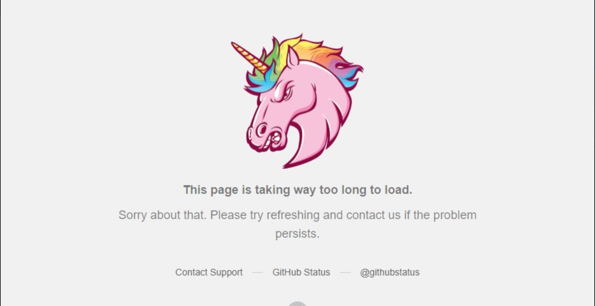

# Lessons Learned Managing a GHE Instance

## What's this?

Hopefully a few helpful notes for support engineers who have been assigned issues with Github Enterprise. Be aware that these factoids are from practical experience and *zero training or theoretical basis*. YMMV, remember to floss.

* [Emergency Procedures](Emergency-Procedures)  
* [Integrations & External Programs](Integrations-and-External-Programs)  
* [Ergonomics & Annoyances](Ergonomics-and-Annoyances)  
* [Performance](Performanc)


### Emergency Procedures

#### Pre-Flight Checks Failing

If a previously-working instance was rebooted after a crash, running ```ghe-config-apply``` will force the config files to be reloaded and services restarted on a GHE instance. 

#### Pink Unicorn Error

If the front page of a GHE instance shows a Pink Unicorn:  

  

Check the state & fullness of filesystems on the appliance, this has been symptomatic of a filled disk before.

#### Deleted Repos

##### Restoring from ghe-backup archive

If a repository is too-long gone to be recovered from https://$INSTANCE/stafftools/$ORGANIZATION/$REPO, single repositories can be recovered from a backup snapshot. Extract *both* the repository and the network repository (../network.git) onto a fresh VM with a standalone git server.

#### LDAP 

LDAP auth will fail in puzzling ways if the ```user-groups``` option of ```github.conf``` doesn't have a tailing semi-colon.


### Integrations and External Programs

#### NuGet

NuGet is observed to ***not work well with git 2.19***. As-of 2019-01-01 Windows users are encouraged to walk back to 2.18 in the face of incredibly slow git traffic. This seems to be related to the cURL library distributed.

#### Interactions between git and GHE:

* You may make an end-run around a potentially bad .gitconfig with ```HOME="" git cmd```

* Use an alternate SSH key with ```GIT_SSH_COMMAND="ssh -i /$PATH_TO_SSH_KEY" git cmd```

* GHE trusts *whatever* is in .gitconfig, with potentially hilarious results. This is frequently demonstrated with nonsensical committer names.

* If you ```git mv``` or rename a file stored in GHE the log is restarted. Use ```git log --follow``` to track all changes.

#### Interactions between Jenkins and GHE:

* Jenkins pipeline scans process *every* tag and *every* branch of *every* repo of a target organization.  

***If you do not perform regular housekeeping on organizations Jenkins will hammer on the Api::RepoCommits API endpoint and potentially slow/crash a GHE instance.***

#### GHE & Python libs:

* python git libraries honor .netrc content, this may be unexpected.

  
### Restoring repos from ghe-backup snapshots

  [Complete instructions](GHE_repo_recovery.md) are available, or...

* Copying .git directories generated by [ghe-backup](https://github.com/github/backup-utils) snapshots may be frustrated by missing ref errors. In this case also copy the ../network.git directory.
  
  
  
### Abuse Throttle

* "The Abuse Throttle" can make stability problems ***much worse*** in a large corporate network. Unauthenticated API calls will have their ```rate_limit_key``` set to the caller's IP, and any user routed through that IP address will be treated as an abusive user. 
 
 
Admins on networks that segregate traffic between PC and development networks with acess routers or firewalls please take note. 
  
  
  
### RESQUE

  * The maintenance queue pauses during backup executions


### Ergonomics and Annoyances

#### Github Organizations

* Organization invitations from members who left the group are in a Twilight Zone where they cannot be accepted or deleted.
* A group mentioned in a repo CODEOWNERS file must have explicit write access to the repo to work properly.

#### GHE Username/Profile Links

* Clickable links for a username are driven by the named user's email address.

#### Github Enterprise Auth

* There is no such animal as a "read-only user", but a token with no permissions can clone repositories.

#### Notifications

* *Organizations are users*, and can be disabled. If an organization *is* disabled, it *cannot* send notifications; usually manifested as issues with PR comments not being emailed to watchers.

#### Pull Requests

* Pull Requests can only be assigned to collaborators.  

* If a search shows code but serves 404 links, reindex the code @ ```https://$URL.com/stafftools/repositories/$ORG_NAME/$REPO_NAME/search```  

* OAUTH application authentication (specifically for GitHub Desktop) will fail in strange ways if a user is provisioned without an email address.  

* If you have an internal CA, remember to append the intermediate certificate underneath the server PEM and upload this entire SSL package. Browsers have trust intermediary certs pushed by IT, the Java integrations do not.

Intermediate certificate errors look-like:

```
+com.sun.jersey.api.client.ClientHandlerException: javax.net.ssl.SSLHandshakeException: sun.security.validator.ValidatorException: PKIX path building failed: sun.security.provider.certpath.SunCertPathBuilderException: unable to find valid certification path to requested target
```


### State of upgrade

* Track upgrade status at /data/user/common/ghe-config.log
